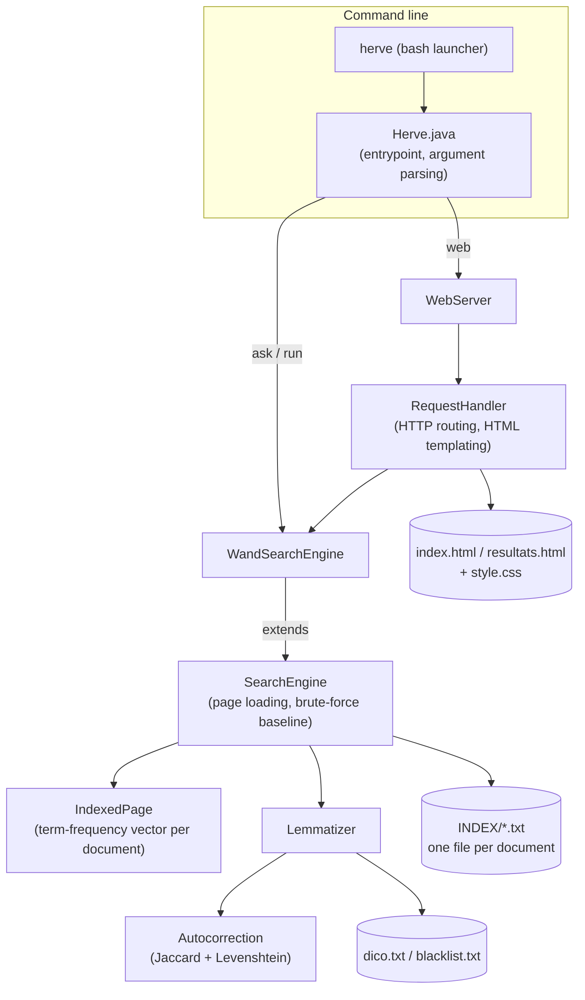
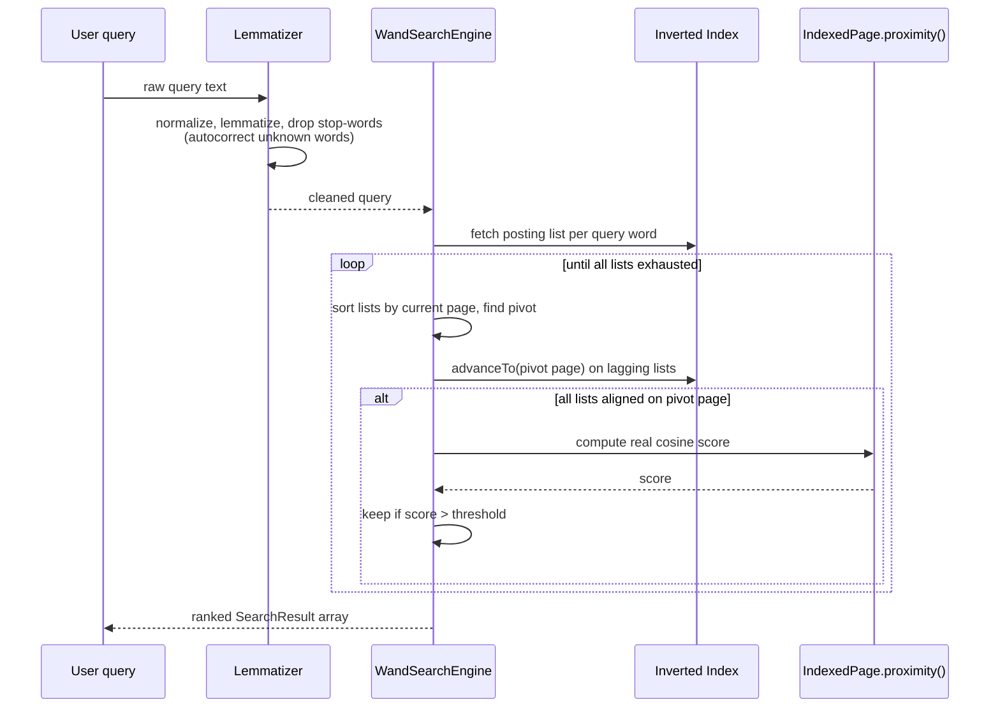

# Hervé — A Vector-Space Search Engine

A Java search engine built from scratch, with cosine-similarity ranking, WAND query optimization, French lemmatization, and typo-tolerant autocorrection. It is available as a command-line tool and as a local web interface.

**Stack:** Java 21 (OpenJDK), no external dependencies. **Platform:** Linux (developed and tested on Debian 12/13). **Type:** University team project.

---

## Table of Contents

- [Overview](#overview)
- [Features](#features)
- [Architecture](#architecture)
- [Project Structure](#project-structure)
- [How Search Works](#how-search-works)
  - [1. Indexed pages as vectors](#1-indexed-pages-as-vectors)
  - [2. Lemmatization and normalization](#2-lemmatization-and-normalization)
  - [3. Autocorrection](#3-autocorrection)
  - [4. Ranking: cosine similarity](#4-ranking-cosine-similarity)
  - [5. WAND: skipping pages without scoring them](#5-wand-skipping-pages-without-scoring-them)
- [Building the Project](#building-the-project)
- [Using the CLI](#using-the-cli)
- [Using the Web Interface](#using-the-web-interface)
- [Configuration Files](#configuration-files)
- [Testing](#testing)
- [Known Limitations](#known-limitations)

---

## Overview

Hervé ("HeRVé" — a play on *Recherche Vectorielle*, French for "vector search") is a search engine that performs keyword search over a corpus of pre-indexed documents (for example, crawled web pages) and ranks results by relevance using the vector space model. It is written entirely in standard Java, using only the JDK standard library.

It supports three modes of use:

- One-shot queries from the terminal (`herve ask`)
- Interactive queries in the terminal (`herve run`)
- A local web interface (`herve web`)

All text handling — index files, dictionaries, terminal and web output — is UTF-8 throughout, to correctly support the French sample data.

---

## Features

| Feature | Description |
|---|---|
| Vector-space ranking | Documents and queries are represented as term-frequency vectors; relevance is the cosine similarity between them |
| WAND query optimization | An inverted-index search engine that skips scoring documents which cannot possibly make the top results, using per-term score upper bounds and binary-search cursor advancement |
| Lemmatization | Query words are reduced to their dictionary lemma (e.g. a conjugated verb to its infinitive) before matching, using a flat-file French dictionary |
| Typo-tolerant autocorrection | Unrecognized words are corrected against the dictionary using Jaccard bigram pre-filtering followed by Damerau-Levenshtein edit distance |
| Stop-word filtering | A blacklist removes common French function words (`je`, `tu`, `il`, etc.) and words of two letters or fewer before ranking |
| Three CLI modes | `ask` (single query), `run` (interactive mode), `web` (HTTP server) |
| Web interface without JavaScript | The results page is built from HTML and CSS only, served by Java's built-in `com.sun.net.httpserver.HttpServer` |
| Search history | The web server keeps an in-memory list of recent queries and shows them as suggestions on the home page |
| Configurable at runtime | Index directory, result count, score threshold, and port are all set via CLI flags |

---

## Architecture



`WandSearchEngine` extends `SearchEngine` rather than replacing it. `SearchEngine` handles page loading, lemmatization, and a simple brute-force `search()` that scores every document. `WandSearchEngine` overrides `search()` with the WAND algorithm, reusing the parent's loaded pages and lemmatizer, and calling `IndexedPage.proximity()` for the real score once a candidate page can no longer be skipped. The two engines are functionally interchangeable; `WandSearchEngineTests` confirms they return identical, identically ordered results.

---

## Project Structure

```
Search-Engine-main/
├── herve                          # Bash launcher: java -cp bin herve.Herve "$@"
├── compile_projet                 # Build script (javac, excludes test files)
├── README.md
│
└── src/
    ├── herve/
    │   └── Herve.java             # CLI entrypoint: argument parsing, ask/run/web dispatch
    │
    ├── herve_web/
    │   ├── WebServer.java         # Starts the embedded HttpServer, exposes /test healthcheck
    │   └── RequestHandler.java    # Routes requests, renders HTML templates, serves static assets
    │
    ├── search_engine/
    │   ├── SearchEngine.java      # Loads indexed pages, brute-force cosine search, own CLI main()
    │   ├── WandSearchEngine.java  # Inverted index and WAND algorithm (optimized search)
    │   ├── IndexedPage.java       # Term-frequency vector for one page (or one query)
    │   ├── Lemmatizer.java        # Dictionary lookup and blacklist filtering for queries
    │   ├── Autocorrection.java    # Jaccard bigram filter and Damerau-Levenshtein correction
    │   └── SearchResult.java      # (url, score) pair, sortable by descending score
    │
    ├── search_engine_tests/
    │   ├── SearchEngineTests.java       # Tests for normalization, IndexedPage, lemmatization
    │   └── WandSearchEngineTests.java   # Verifies WandSearchEngine matches SearchEngine
    │
    └── assets/
        ├── LEMMES/
        │   ├── dico.txt            # word:lemma dictionary (French)
        │   └── blacklist.txt       # Stop words excluded from scoring
        ├── exemples-fichiers/
        │   └── INDEX/              # 100 sample pre-built index files (one per document)
        ├── css/                    # style.css, resultats.css
        ├── doc/logo.svg
        ├── index.html              # Search form, with an {{HISTORY}} template tag
        └── resultats.html          # Results page, with {{QUERY}} and {{RESULTS}} template tags
```

---

## How Search Works

### 1. Indexed pages as vectors

Each document lives in its own file under an `INDEX` directory. The first line is the document's URL; every subsequent line has the form `word:count`:

```
https://fr.vikidia.org/wiki/Flaugnarde
an:1
pager:1
avec:1
nom:1
```

`IndexedPage` parses this into a term-frequency vector — a map of word to occurrence count — and pre-computes its Euclidean norm (the square root of the sum of squared counts), used for cosine normalization. The same class also represents a query, as a virtual, one-off "page" built directly from the raw query text.

Word text is always passed through `IndexedPage.normalize()` first: lowercased, accents stripped (NFD decomposition), and anything outside `[a-z0-9]` removed — so `"Météo!"` and `"meteo"` are treated as the same word.

### 2. Lemmatization and normalization

Before a query is turned into a vector, `Lemmatizer.lemmatizeQuery()`:

1. Lowercases the text and replaces non-alphanumeric characters with spaces.
2. Drops words of two characters or fewer.
3. Looks each word up in `dico.txt` (a flat `word:lemma` dictionary) and replaces it with its lemma — for example, a conjugated verb form maps to its infinitive.
4. Drops the word entirely if its lemma appears in `blacklist.txt` (French stop words such as `je`, `tu`, `il`, `elle`, `on`).

This keeps document and query vocabulary consistent, whether a user searches `"mangeait"` or `"manger"`.

### 3. Autocorrection

If a query word is not found in the dictionary, `Autocorrection.correct()` attempts to fix it in two stages, for performance reasons — checking full edit distance against every dictionary word would be too slow:

1. **Pre-filter — Jaccard distance on bigrams.** Each word is broken into overlapping two-letter chunks (for example, `cheval` becomes `{ch, he, ev, va, al}`). Only dictionary words whose bigram sets overlap sufficiently (Jaccard distance at or below `0.8`) are considered further.
2. **Precise check — Damerau-Levenshtein distance.** Remaining candidates are compared using edit distance, which accounts for insertions, deletions, substitutions, and adjacent-letter transpositions. The closest match is accepted only if its distance is at or below `2`.

If no candidate qualifies, the original word is used as-is.

### 4. Ranking: cosine similarity

`IndexedPage.proximity(other)` computes the cosine similarity between two term-frequency vectors:

```
similarity(A, B) = sum over shared words w of  (countA(w) / ||A||) * (countB(w) / ||B||)
```

The result is a value between `0` (no shared vocabulary) and `1` (identical vectors). This favors documents that share many query words and where those words make up a larger share of the document's own content, rather than simply counting raw matches.

`SearchEngine.search()` applies this directly: it lemmatizes the query, builds its vector, computes `proximity()` against every loaded page, filters by the score threshold, and sorts the results in descending order.

### 5. WAND: skipping pages without scoring them

Scoring every document on every query does not scale. `WandSearchEngine` builds an inverted index at startup — for each word, a sorted list of the pages that contain it, along with that word's maximum possible score contribution — and uses the WAND (Weak AND) algorithm to skip documents that cannot possibly score high enough to matter:

1. For each query word, look up its posting list and reset its cursor.
2. Sort the lists by the page number each one currently points to.
3. Accumulate each word's maximum possible contribution across the sorted lists; the word at which the running total exceeds the threshold becomes the pivot.
4. Advance (via binary search) every list before the pivot up to the pivot's page number.
5. Once every list points to the same page, compute the real cosine score for that page, using the same `IndexedPage.proximity()` used by the brute-force engine, and keep the result if it clears the threshold.
6. Advance all lists past that page and repeat until a list is exhausted.

Because the real score is only computed for pages that survive the pivot check, WAND can skip large parts of the corpus on selective, multi-word queries. `WandSearchEngineTests` confirms it returns exactly the same ranked results as the brute-force `SearchEngine`.



---

## Building the Project

Prerequisites: OpenJDK 21 or compatible, Linux, no other dependencies.

```bash
# From the project root
chmod +x compile_projet herve
./compile_projet
```

`compile_projet` runs:

```bash
javac -encoding utf8 -cp src -d bin/ $(find src -name '*.java' ! -name '*Test.java' ! -path '*/test*')
```

This compiles everything under `src/` (excluding test classes) into `bin/`. Output encoding is UTF-8 throughout, to correctly handle French text.

---

## Using the CLI

The compiled program is run through the `herve` wrapper script, which calls `java -cp bin herve.Herve "$@"`.

### `herve ask` — one-shot query

```
herve ask [--index <index-directory>] [--max <max-results>] [--seuil <minimal-score>] <keywords>
```

| Option | Meaning | Default |
|---|---|---|
| `--index <dir>` | Directory containing the `<N>.txt` index files | `~/.config/herve/INDEX` if it exists, otherwise the bundled `src/assets/exemples-fichiers/INDEX` |
| `--max <n>` | Maximum number of results to display | unlimited |
| `--seuil <s>` | Minimum score (strictly greater than) for a result to be shown | `0.0` |

Example:

```bash
herve ask --index src/assets/exemples-fichiers/INDEX --max 5 tomate oignon
```

### `herve run` — interactive mode

```
herve run [--index <index-directory>] [--max <max-results>] [--seuil <minimal-score>]
```

Starts a loop: type a query, press Enter, see ranked results; type `exit` to quit. Options are the same as `ask`.

### `herve web` — local web interface

```
herve web [--index <index-directory>] [--max <max-results>] [--seuil <minimal-score>] [--port <port>]
```

| Option | Meaning | Default |
|---|---|---|
| `--port <p>` | Port for the embedded HTTP server | `2026` |

The server binds to `127.0.0.1` only. Before starting a new instance, `herve web` checks `http://127.0.0.1:<port>/test` — if a Hervé server is already responding there, it reuses it rather than starting a duplicate. If a graphical environment is available, it also opens the URL automatically.

---

## Using the Web Interface

Once running, open `http://127.0.0.1:2026` (or the chosen port) in a browser.

- The home page (`index.html`) shows a search box and, if any queries have been run during the session, a row of clickable "recent searches" links, inserted server-side into the `{{HISTORY}}` placeholder.
- Submitting a search (`?q=...` or `?search=...`) renders `resultats.html`, with the query and formatted result blocks inserted into `{{QUERY}}` and `{{RESULTS}}`. Each result shows the raw URL, a cleaned-up title (Wikipedia/Vikidia-style `/wiki/` slugs are decoded and de-underscored), and the relevance score.
- Static assets (`.css`, `.svg`) are served directly from `src/assets/` by `RequestHandler`.
- The front end is written in HTML and CSS only, with no JavaScript, by design.

---

## Configuration Files

| File | Purpose |
|---|---|
| `src/assets/LEMMES/dico.txt` | `word:lemma` pairs, one per line, used to reduce query words to their canonical form |
| `src/assets/LEMMES/blacklist.txt` | One stop word per line; dropped from every query after lemmatization |
| `<index-dir>/<N>.txt` | One file per indexed document: URL on line 1, then `word:count` lines |

There is no separate runtime configuration file (such as `.yaml` or `.json`); all runtime behavior is controlled by the CLI flags documented above. The application is designed to run correctly even without any optional configuration present.

---

## Testing

Two test files live under `src/search_engine_tests/` and are excluded from the normal build by `compile_projet`. They use plain `main()` methods rather than a test framework, since no external libraries (including JUnit) are used in this project.

- `SearchEngineTests` — checks word normalization (accents, punctuation), `IndexedPage` vector construction from raw text, and lemmatization behavior.
- `WandSearchEngineTests` — builds small in-memory indexes and asserts that `WandSearchEngine` returns identical results, in identical order, to the brute-force `SearchEngine`, confirming the WAND optimization does not change correctness.

To run them manually:

```bash
javac -encoding utf8 -cp src -d bin src/search_engine_tests/*.java src/search_engine/*.java
java -cp bin search_engine_tests.SearchEngineTests
java -cp bin search_engine_tests.WandSearchEngineTests
```

---

## Known Limitations

- **No indexing pipeline.** The `herve index` subcommand mentioned as optional in the original specification is not implemented. This codebase only reads pre-built index files under an `INDEX` directory (100 sample files are bundled under `src/assets/exemples-fichiers/INDEX`). Generating those index files from a live website or crawl is not part of this repository.
- **In-memory search history.** The web server's list of recent searches is per-process and resets on restart; it is not persisted anywhere.
- **No authentication or remote binding.** The web server listens on `127.0.0.1` only and is not intended to be exposed beyond localhost as-is.
- **French-only dictionary and blacklist.** Lemmatization and stop-word filtering assume French vocabulary (`dico.txt`, `blacklist.txt`); other languages would require replacing these files.
- **No automated test runner.** Test classes use ad hoc `main()` methods rather than a test framework, consistent with the project's constraint of using only the Java standard library.
